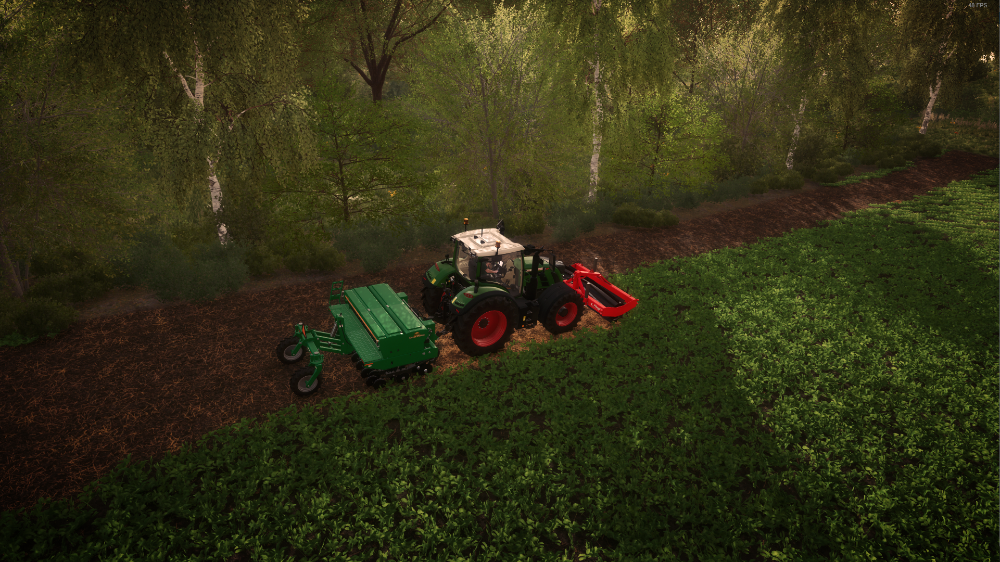
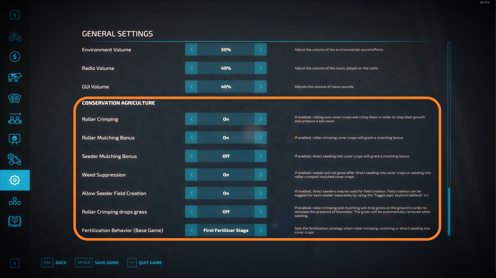

# FS22_ConservationAgriculture

## Mod description

This mod for Farming Simulator 22 strives to allow the player to respect the three [Conservation Agriculture](https://www.fao.org/conservation-agriculture/en/) principles while at the same time getting a benefit in doing so.
Read the description in the [mod desc xml](modDesc.xml) for more information.

Roller crimping cover crops and direct seeding straight into them:

Roll, mulch or direct seed into cover crops and receive a fertilization and mulching bonus (no mulch bonus for direct seeding):

Create fields with direct seeders - Throw your plow away for good:

Precision Farming support:

Many configuration options to adjust to what you think is realistic:

## How to install

1. Download the newest zip from the [Releases page](https://github.com/Timmeey86/FS22_ConservationAgriculture/releases)
1. Place the zip file in your FS22 mod folder
1. Start the game and use like any other mod

## How to debug/code

1. Obviously, own a copy of Farming Simulator 22
1. Clone this folder anywhere
1. Use Visual Code with at least the Lua Language Server Plugin for coding
1. When testing, execute copytofs.bat and open that mod folder in Giants Studio
1. Debug in Giants Studio